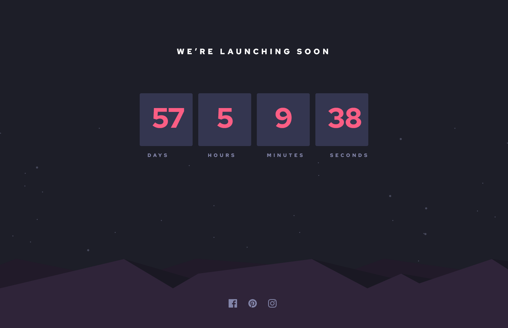

## Table of contents

- [Overview](#overview)
  - [The challenge](#the-challenge)
  - [Screenshot](#screenshot)
  - [Links](#links)
- [My process](#my-process)
  - [Built with](#built-with)
  - [What I learned](#what-i-learned)
  - [Continued development](#continued-development)
  - [Useful resources](#useful-resources)
- [Author](#author)
- [Acknowledgments](#acknowledgments)

## Overview

In this project I mainly needed to focus on page layout,page responsiveness and timer functionality.

### The challenge

Users should be able to:

- View the optimal layout for each page depending on their device's screen size

### Screenshot

### Links

- Solution URL: [GitHub Code](https://github.com/Tusho7/count-down-timer)
- Live Site URL: [GitHub Live](https://count-down-timer-two.vercel.app/)

## My process

Change background color of body
Add background images
Add icons and text
Give icon sizes and styles in CSS
Create hover effects for icons
Add React code(useState & useEffect) to create timer

### Built with

- Semantic HTML5 markup
- CSS custom properties
- Mobile first approach
- Flexbox
- Media Queries
- React

### What I learned

While working on this project, I gained more practise of using React, the main challenge that I overcame was to create React Functionality for the timer.After research and practicing different ways for resolving this step, I wrote the React code which worked eventually.

### Continued development

I want to create other projects like this to finally master coding and make more dynamic, interactive and functional projects

## Author

- GitHub - [Sandro Tushurashvili](https://github.com/Tusho7)
- LinkedIn - [Sandro Tushurashvili](https://www.linkedin.com/in/sandro-tushurashvili/)
